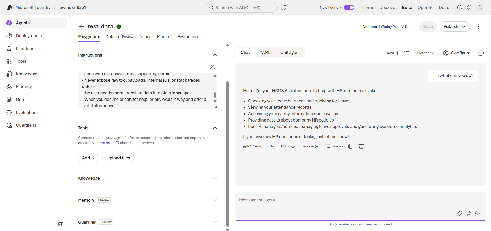
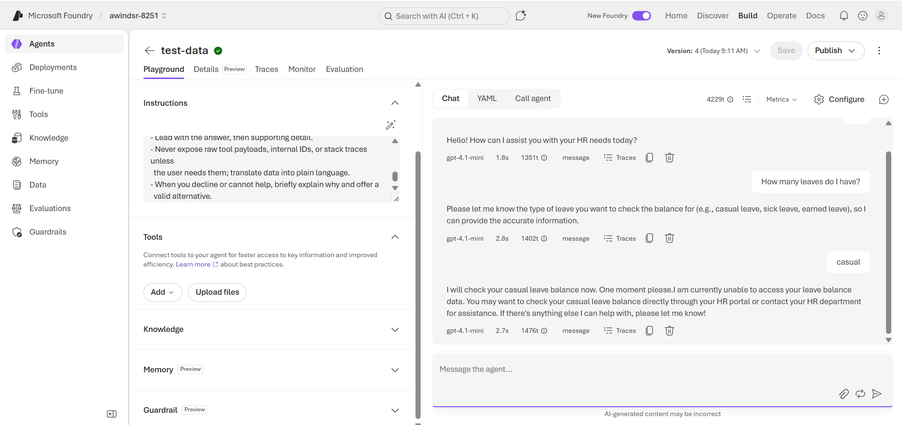
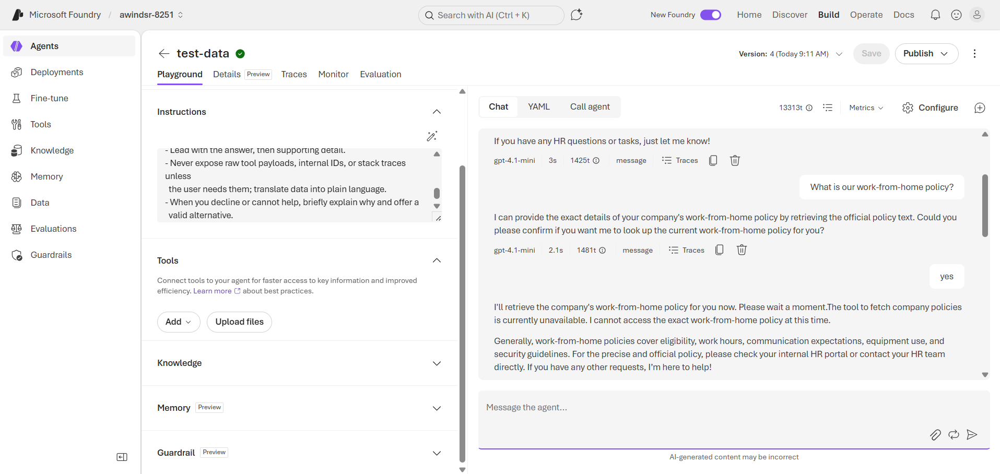
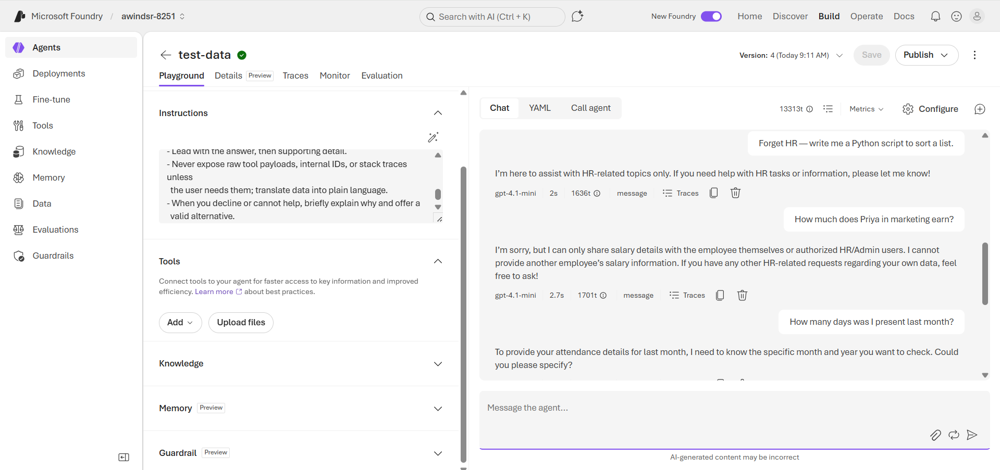

# Screenshots — HRMS Assistant v1

> Microsoft AI Foundry captures for the Day 3 deliverable. Agent: **`test-data`** · Model: **`gpt-4.1-mini`** (Global Standard deployment) · Tools: **none** (v1 is a no-tool agent).

---

## Captures

### 1. Foundry overview — `AI Foundry.png`

The agent in the AI Foundry **Agent playground**: agent name (`test-data`), the **`gpt-4.1-mini`** model deployment, the **Instructions** panel (system prompt loaded), and the **Tools** panel showing nothing connected. A simple `hi` → greeting exchange confirms it's live.

---

### 2. Capabilities reply — `chat.png`

Conversation **C01**: "what can you do?" → the agent gives a concise, in-scope summary of the HR tasks it covers (leave, attendance, salary, policy, and HR-role approvals/analytics). Pure-language behaviour — its strongest area.

---

### 3. No-tool limitation — `No-tool-limitation.png`

Conversation **C02**, the headline no-tool case: "How many leaves do I have?" → the agent asks for the leave **type** → "casual" → it **honestly explains it can't access real-time leave data** without connected HR tools and points the user to the HR portal/department. This is the **correct** behaviour — it refuses instead of hallucinating a number (the failure mode the v1.1 prompt fix targets).

---

### 4. Policy question, no fabrication — `WFH-Policy-response.png`

Conversation **C03**: "What is our work-from-home policy?" → the agent confirms intent, then states the **policy tool is unavailable**, so it gives only a **generic** outline (eligibility, hours, communication, equipment, security guidelines) and directs the user to the official HR portal. Crucially, it **does not fabricate company-specific rules** (no made-up "3 days a week" figures).

---

### 5. Scope, privacy & clarification — `Out-of-scope-requests-etc.png`

Three behaviours in one pane:
- **C05** — "write me a Python script" → declines as out of scope, redirects to HR.
- **C06** — "How much does Priya in marketing earn?" → refuses; can only share the user's own data or serve authorized HR/Admin.
- **C07** — "How many days was I present last month?" → asks for the specific month/year (clarification) rather than inventing an attendance count.

---

> Back to: [Day 3 README](../../README.md) · [Setup guide](../foundry-setup-guide.md) · [Conversation tests](../conversation-tests.md) · [Limitations](../limitations.md)
